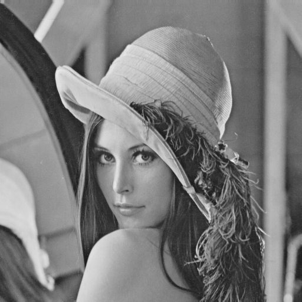
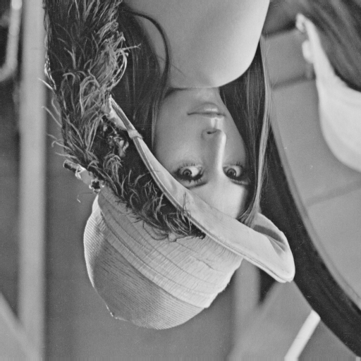
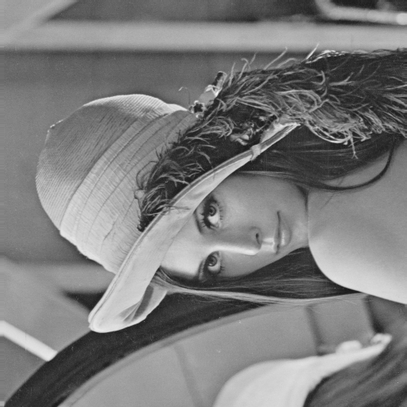
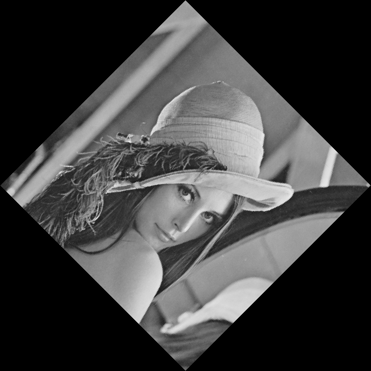
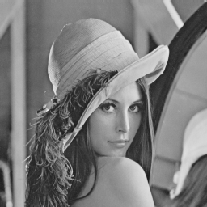
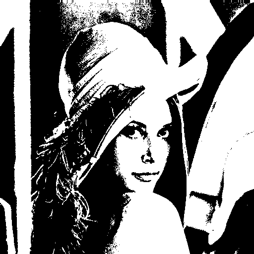

# Homework 1 Report — Image Operations with Pillow (PIL)

**Student ID:** R14922062  
**Name:** 連奕維   

---

## 1) Brief Description

This homework applies six basic image transformations to `lena.bmp`:

**Part 1 (pixel-by-pixel, manual):**
- (a) Upside-down (vertical flip)
- (b) Right-side-left (horizontal flip)
- (c) Diagonal flip across the main diagonal

**Part 2 (using PIL helpers):**
- (d) Rotate 45° clockwise (expand canvas)
- (e) Shrink by half (downsampling)
- (f) Binarize with threshold 128

All results are saved in `./images/` and pasted below.

---

## 2) Algorithms Used

### Part 1 — Manual (Pixel-by-Pixel)
Let the source image be size **(W, H)** and grayscale.

- **(a) Upside-down (vertical flip)**  
  For each pixel `(x, y)` in the output, copy from `(x, H−1−y)` in the input.

- **(b) Right-side-left (horizontal flip)**  
  For each pixel `(x, y)` in the output, copy from `(W−1−x, y)` in the input.

- **(c) Diagonal flip (main diagonal)**  
  This is a transpose: for each `(x, y)` in the output, copy from `(y, x)` in the input.  
  (Note: output size becomes **(H, W)**; if the image is square, size stays the same.)

### Part 2 — With PIL
- **(d) Rotate 45° clockwise**  
  Use `img.rotate(-45, expand=True, fillcolor=0)` so the canvas grows to prevent cropping; fill empty area with black.

- **(e) Shrink by half**  
  Use `img.resize((W//2, H//2), resample=Image.Resampling.BOX)` (BOX is appropriate for downsampling).

- **(f) Binarize @128**  
  Map each grayscale value `p` to 255 if `p ≥ 128`, else 0, via `img.point(...)`, then keep it as single-channel `'L'`.

---

## 3) Parameters

- **Binarization threshold**: τ = **128**  
- **Downsampling filter**: **BOX** (suitable for reductions)  
- **Rotation**: **−45°** (clockwise), `expand=True`, `fillcolor=0` (black)

---

## 4) Principal Code Fragments

### Part 1 — `hw1-1.py` (manual pixel operations)

```python
from PIL import Image

def getUpSideDown(img: Image.Image) -> Image.Image:
    column, row = img.size
    newImg = Image.new('L', (column, row))
    [newImg.putpixel((c, r), img.getpixel((c, row - 1 - r)))
     for r in range(row) for c in range(column)]
    return newImg

def getRightSideLeft(img: Image.Image) -> Image.Image:
    column, row = img.size
    newImg = Image.new('L', (column, row))
    [newImg.putpixel((c, r), img.getpixel((column - 1 - c, r)))
     for r in range(row) for c in range(column)]
    return newImg

def getDiagonallyMirrored(img: Image.Image) -> Image.Image:
    column, row = img.size
    newImg = Image.new('L', (row, column))
    [newImg.putpixel((c, r), img.getpixel((r, c)))
     for r in range(column) for c in range(row)]
    return newImg
```

### Part 2 — `hw1-2.py`
```python
def rotate_45_clockwise(img: Image.Image) -> Image.Image:
    return img.rotate(-45, expand=True, fillcolor=0)

def shrink_half(img: Image.Image) -> Image.Image:
    w, h = img.size
    return img.resize((w // 2, h // 2), resample=Image.Resampling.BOX)

def binarize_128(img: Image.Image) -> Image.Image:
    return img.point(lambda p: 255 if p >= 128 else 0, mode='1').convert('L')
```

## 5) Result Image
This section includes a series of image references demonstrating various image transformations.
The images illustrate the following operations:
- Right-side left mirroring
- Upside-down flipping
- Diagonal mirroring
- 45-degree rotation
- Shrinking to half size
- Binarization with a threshold of 128

Each image is linked from the local 'images' directory for visual reference.








## 6) Reproduce

```sh
pip install -r requirement.txt  # install requirements
python hw1-1.py
python hw1-2.py
```

## 7) Something to tell

The report is tided up with ai, but the content is generated by myself.